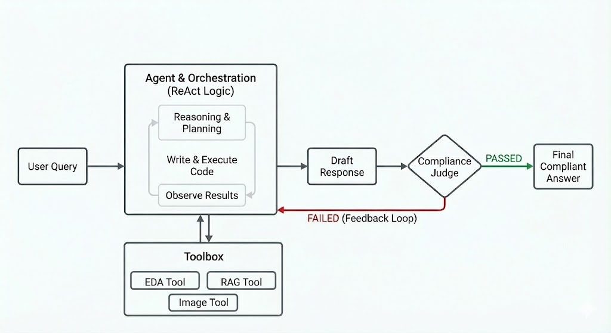
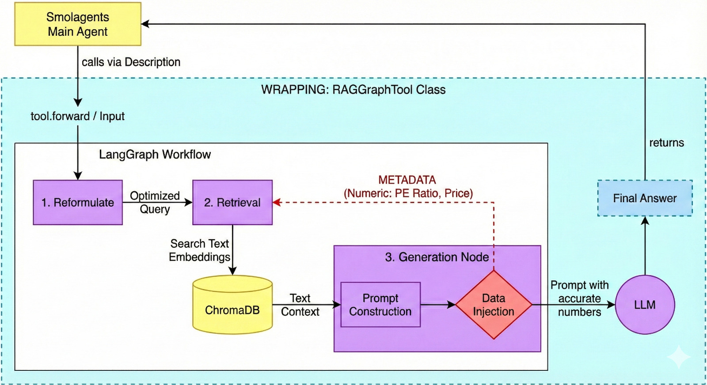
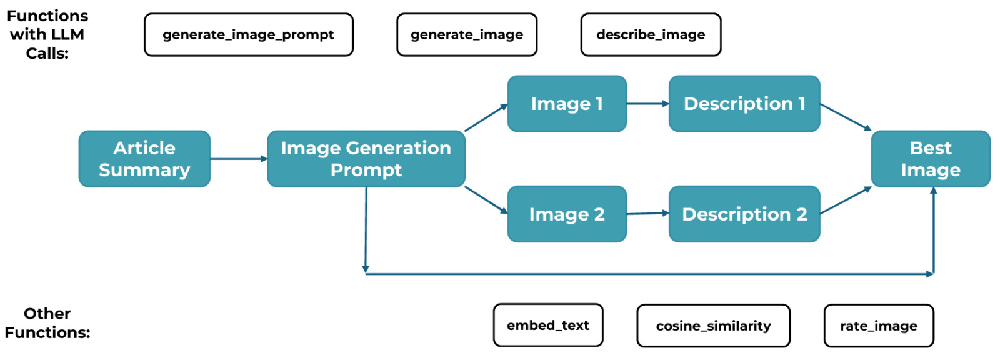

# 🤖 Smol-Quant: Autonomous Financial Analyst Agent

## 📖 Project Overview

**Smol-Quant** is an autonomous agentic system designed to simulate the workflow of a junior financial analyst. 

### The Problem
Standard LLMs frequently hallucinate financial data when asked to perform precise calculations or retrieve up-to-date market information. They lack access to verified internal datasets and often fail to distinguish between creative writing and factual reporting.

### The Solution: Grounded Truth
The agent cannot invent numbers. It must retrieve them from two distinct, verified data sources:
1.  **Structured Data:** A comprehensive NASDAQ-100 dataset (CSV) for hard metrics like PE Ratio, Volatility, and Market Cap.
2.  **Unstructured Data:** A Vector Database (ChromaDB) containing news, business summaries, and context from sources like Wikipedia and Yahoo Finance.

---

## 🏗️ System Architecture

### 1. The Brain: CodeAgent (Orchestrator)
At the core lies the `CodeAgent`. Unlike a simple chatbot, this component acts as a reasoning engine. It writes and executes Python code to solve complex problems.

### 2. The Logic: ReAct Pattern
The agent follows the **ReAct (Reasoning + Acting)** paradigm. For every user query, it autonomously cycles through:
* **Reasoning:** Analyzing the user's intent.
* **Tool Selection:** Deciding which specific tool is required.
* **Observation:** Reading the output of the tool execution to inform the next step.

### 3. The Safety: LLM-as-a-Judge Pipeline
To ensure operational safety, we implemented a **"Compliance Officer"** layer. This secondary model intercepts every draft response before it reaches the user.
* **Compliance Check:** Scans for financial advice violations or hallucinations.
* **Self-Correction Loop:** If the Judge rejects an answer, the feedback is injected back into the agent's memory, forcing it to replan and correct its output automatically.



---

## 🛠️ The Toolset

The agent is sandboxed and equipped with three specialized tools to handle different data modalities.

### 1. EDA Tool (`eda_summary`)
* **Function:** Acts as the data scout.
* **Capability:** Provides the agent with metadata, column structures, and statistical summaries of the NASDAQ-100 dataset. This allows the agent to understand the "shape" of the data before performing deep analysis.

### 2. Financial Analyst Tool (`financial_analyst`)
* **Function:** The RAG (Retrieval Augmented Generation) interface.
* **Capability:** Performs semantic searches within the ChromaDB vector store. It retrieves qualitative context—such as recent strategic challenges or leadership changes—to explain the "why" behind the numbers.



### 3. Image Generation Tool (`image_generation_tool`)
* **Function:** The visual artist.
* **Capability:** Connects to generative image models (DALL-E 3) to create illustrative visuals for abstract concepts, such as "market sentiment" or "bull runs," adding a multi-modal dimension to the report.



---

## 🔒 Security & Sandbox Environment

To prevent the agent from executing malicious code, the `CodeAgent` operates within a restricted local sandbox. It does not have unrestricted access to the host machine's shell or file system.

### Allowed Libraries
The agent is strictly limited to importing only a specific set of safe libraries required for data analysis and visualization. Any attempt to import unauthorized modules (e.g., `os`, `sys`, `requests`) is blocked by the runtime.

**Authorized Imports:**
* `pandas` (Data Manipulation)
* `numpy` (Numerical Computing)
* `matplotlib.pyplot` & `seaborn` (Data Visualization)
* `io`, `base64`, `json`, `ast` (Data Processing)

---

## 📂 Project Structure

The project follows a modular architecture separating logic, tools, and data.

```text
GenAI/
├── agent/
│   ├── agent_builder.py              # Builds the agent and gives it personality
│   └── tools/                        # The specific tools the agent can use
│       ├── smol_rag_tool.py          # Tool to search the database for news/text
│       ├── smol_eda_tool.py          # Tool to read and analyze the CSV numbers
│       └── smol_image_tool.py        # Tool to create AI images via DALL-E
├── data/
│   ├── chroma_db/                    # The folder where the vector database lives
│   └── nasdaq_100...csv              # The main data file with stock info
├── data_ingestion/
│   └── data_scraping_embedding.py    # Script to download fresh data and update the database
├── images/                           # Pictures for the documentation
│   ├── Agent.jpeg
│   ├── Image.jpeg
│   └── Rag.jpeg
├── evaluate_agent.py                 # Script to test and grade the agent's performance
├── main.py                           # Run this to chat in the terminal (CLI)
├── app.py                            # Run this to start the web app (Streamlit)
├── requirements.txt                  # List of Python libraries needed
├── .env                              # Place your API keys here
├── Dockerfile                        # Instructions to build the app container
├── docker-compose.yaml               # Config to start everything easily with Docker
└── .dockerignore                     # Files that Docker should ignore
```

---

## ⚙️ Installation & Setup

### Prerequisites

* Python 3.10 or higher
* OpenAI API Key (with access to GPT-4o and DALL-E 3)

### 1. Clone Repository

```bash
git clone <repo-url>
cd GenAI

```

### 2. Configuration

Create a `.env` file in the root directory and add your credentials:

```ini
OPENAI_API_KEY=sk-proj-xxxxxx...
# Optional: Model overrides
OPENAI_MODEL=gpt-4o-mini

```

### 3. Choose Deployment Method

You can run the application either via Docker (Recommended) or a local Python environment.

#### Option A: 🐳 Docker (Easy Start)

Recommended to ensure a consistent environment and avoid dependency conflicts.

**1. Build and Start Container**
* Optional Performance Tip: To reduce build time from ~15 mins to ~2 mins, open requirements.txt and comment out torch and transformers (only needed for fresh data scraping)
* Ensure your `.env` file is present, then run:

```bash
docker-compose up --build -d

```

*Note: The first build may take ~10-15 minutes as it downloads large transformer models.*

**2. Initialize Data (Scraping & Embedding)**
* *Only run this if you kept the heavy libraries installed and need fresh data.*
* To scrape fresh NASDAQ data and build the vector store (approx. 3 mins):
* After executing, a container restart may be needed to use the fresh embeddings.

```bash
docker exec -it smol_quant_app python data_ingestion/data_scraping_embedding.py

```

#### Option B: 🐍 Local Environment (Legacy)

Recommended for development and debugging code directly.

**1. Create Virtual Environment**
*macOS / Linux:*

```bash
python3 -m venv genai
source genai/bin/activate

```

*Windows:*

```bash
python -m venv genai
genai\Scripts\activate

```

**2. Install Dependencies**

```bash
# Tip: Comment out 'torch' and 'transformers' in requirements.txt 
# if you do not plan to run the scraping script locally.
pip install -r requirements.txt

```

**3. Configure Paths**
*Note: Toggle the file paths in `agent_builder.py` to point to your local data folders instead of the Docker volume paths.*

**4. Start Application**

```bash
streamlit run app.py
```

Or for the terminal-only debugging mode: 

```bash
python main.py
```

---

## 🚀 Usage

### 1. Access Web Interface

Once the app is running (via Docker or locally) open your browser at: **[http://localhost:8501](https://www.google.com/search?q=http://localhost:8501)**

The primary way to interact with Smol-Quant is via the Streamlit dashboard, which supports chart rendering, session memory, and real-time visualization of the "Thought Process".

### 2. Evaluation Pipeline (Scientific Validation)

To run the automated quality audit (LLM-as-a-Judge):

```bash
python evaluate_agent.py

```

*This generates a `evaluation_report.md` and `evaluation_rich_data.json` with detailed performance metrics.*

---

## 📊 Methodology & Evaluation

To ensure academic rigor, we implemented an automated evaluation framework inspired by Google's *Purpose-Driven Evaluation*. We test against a **Golden Dataset** covering diverse scenarios.

* **Pillar 1: Agent Success & Quality:** Verified by comparing agent-extracted numbers against ground truth using a semantic LLM Judge.
* **Pillar 2: Process & Trajectory:** Verified by a heuristic validator that ensures the agent selects the correct tool (e.g., using `pandas` for math, not text prediction).
* **Pillar 3: Trust & Safety:** Verified by "Negative Tests" to ensure the agent reports "Data Missing" rather than hallucinating metrics for non-existent companies.

### Current Benchmark Results

In our standardized test runs, the agent achieved an **Overall Robustness Score of 83.3%**.

* **Success:** Perfect execution on Exploration, Quantitative Analysis, RAG, and Visualization tasks.
* **Limitations:** The agent occasionally struggles with "Negative Tests" (detecting non-existent companies), which our Compliance Judge correctly flags as failures.
* *Note: Due to the non-deterministic nature of LLMs, reproduction results may vary slightly between runs.*

---

## ✨ Features & Capabilities

This project implements four core components required by the course curriculum, alongside several advanced bonus features.

### ✅ Core Components (Course Requirements)

1. **Retrieval Augmented Generation (RAG):**
* **Implementation:** Queries a local ChromaDB vector store using OpenAI embeddings to retrieve source-referenced business summaries and news.


2. **Data Analysis & Code Execution:**
* **Implementation:** The agent autonomously writes and executes `pandas` code to analyze a structured CSV dataset, calculating metrics like volatility distributions.


3. **Multi-step Agent Pipeline:**
* **Implementation:** Utilizes a Planner-Executor model where the `CodeAgent` breaks down complex user prompts into logical steps (e.g., Load Data → Check News → Plot Comparison). A second LLM acts as "Compliance Officer" and reviews output from CodeAgent.


4. **Image Generation Integration:**
* **Implementation:** Integrated via function calling to DALL-E 3 for generating illustrative visuals of abstract market concepts.


### 🌟 Bonus & Advanced Features

* **Production-Ready Deployment (Containerization):** Bundles the full application and data ingestion pipeline into a Docker container. Ensures reproducibility and solves environment dependency issues via `docker-compose`.
* **Scientific Evaluation Pipeline:** Implements an automated "LLM-as-a-Judge" framework based on Google's methodology. Audits semantic correctness, tool usage, and safety against a Golden Dataset.
* **Chain-of-Thought Visualization:** Provides full transparency by rendering the agent's internal reasoning steps. Uses Streamlit components to display thoughts, executed code, and tool observations in real-time.
* **Robustness & Safety Guardrails:** Enforces strict behavioral constraints via system prompting and sandboxing. Prevents financial advice and eliminates hallucinations by mandating the "Dual-Sourcing" of quantitative and qualitative data.
* **Self-Correction Loop:** Intercepts agent outputs with a secondary compliance model. Automatically triggers a reasoning refinement loop if the response violates safety protocols or lacks data grounding.
* **Conversation Memory:** Manages persistent session state to enable multi-turn interactions. Allows the agent to retain context and refine previous analysis steps throughout the user session.
* **LLM Caching Strategies:** Utilizes resource caching decorators to optimize performance. Prevents redundant initialization of heavy RAG tools and agent models across user interactions.
